---
Document Metadata
PROJECT     : Documentation of Rfp Wynxx Legacy Transformer
BASE URL    : https://git.gft.com/alze/rfp-legacy-transformer/-/blob/main/Wynxx%20Documentation/Wynxx_Leggacy_Transformer_HowTo.md
DATE CREATED: 25/03/2026 17:10
DATE UPDATED: 31/03/2026 18:50
---

# HowTo Documentation for Wynxx Legacy Transformer Feature

This document is a walkthrough of the Wynx Legacy Transformer workflow.

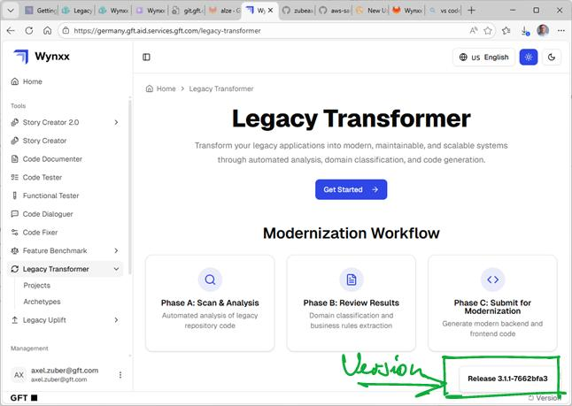
 The version used was v. 3.1.1. 

The process transforms an application implemented with the mainframe programming languages (Cobol, PL/1, DB2/SQL, IMS/DDL, Assembler, REXX/Clist, JCL) and environments (JES2, CICS, IMS TM) to a modern architecture with RESTful micro services, targeted for deployment in containerized environments hosted on public/private cloud infrastructure.

The [Documentation Resources](#documentation-resources) chapter is a compilation of references i collected while conducting this exercise.

In the [Summary](#summary) at the end i briefly present my personal observations regarding usability, error handling and overall user experience with the Wynxx Legacy Transformer along with some ideas on changes that i think would improve overall handling.

---

# Quick Overview

In a nutshell the process for migrating a z/OS application is implemented with a 4-step pipeline that has to be traversed sequentially :

1. [Code Analysis](#code-analysis)
2. [Inventory Generation](#inventory-generation)
    - [Starting Inventory Generation](#starting-inventory-generation)
    - [Reviewing Inventory Domains](#reviewing-inventory-domains)
3. [Business Rule Generation](#business-rule-generation)
    - [Starting Business Rule Generation](#starting-business-rule-generation)
    - [Reviewing Business Rules](#reviewing-business-rules)
4. [Code Generation](#code-generation)
    - [Backend Code Generation](#backend-code-generation)
    - [Frontend Code Generation (optional)](#frontend-code-generation)
    - [Downloading Generated Code](#downloading-generated-code)

Depending on application complexity, the [Inventory Generation](#inventory-generation), [Business Rule Generation](#business-rule-generation) and [Code Generation](#code-generation) steps may involve iterations over a set of `domains` produced in the previous pipeline step.

<b>CAVEAT: As of March 25, 2026 the `Code Generation` step completes successfully but produces empty source files in the target language. This issue is pending with Wynxx support from Brazil.</b>

<b>UPDATE March 31:</b> The root cause of the problem has tentatively been identified as the use of Open AI GPT models (in the Wynxx Instance used it was GPT4-o). The PoCs performed by the Wynxx developers used Anthropic models which did not run into this problem.

There are one-off setup activities that have to be completed prior to starting the transformation pipeline :

- [Configuring Version Control System](#configuring-version-control-system)
- [Creating application archetypes](#creating-application-archetypes)
    - [Creating Archetype Repository](#creating-archetype-repository)
    - [Configuring Archetype in Wynxx](#configuring-archetype-in-wynxx)
- [Creating Wynxx Project](#creating-wynxx-project)

---

# Detailed walkthrough

## Configuring Version Control System

This is a one-off step where we provide Wynxx with the location of the source code for our legacy applications. 
This VCS declaration will later be used in the step [Creating Wynxx Project](#creating-wynxx-project).

We have to supply

- a type (GitHub or other)
- a GitHub space name
- the base url for a GitHub (or other git-like repository application) space
- an access token (generated in the GitHub WebUi)

<b>CAVEAT</b>: This step requires <b>admin privileges</b> for the Wynxx instance.

<b>REMARK</b>: There seems to be some redundancy between VCS and project definitions since both contain the repository base URL.
 
 

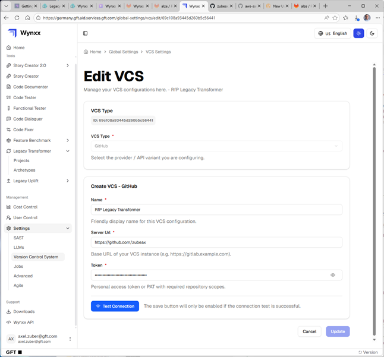

---

## Creating application archetypes

Archetypes are required for the final Code Generation step. They provide Wynxx with a template framework into which the Legacy Transformer will inject the transformed code. 

### Creating Archetype Repository

Archetypes are managed as git repositories that look like any other repository for a spring-boot application, complete with maven configuration for the build process.

As of today, i am aware of 2 archetypes :

- archetype-java-spring   https://github.com/zubeax/archetype-java-spring.git
- archteype-nextjs        https://github.com/zubeax/archetype-nextjs.git

<b>CAVEAT</b>: An archetype repository has to be accessible in the internet (e.g. hosted on Github). git.gft.com is <b>NOT</b> an option.

Here is a screenshot of the GitHub Web-UI for the Spring-Java archetype.

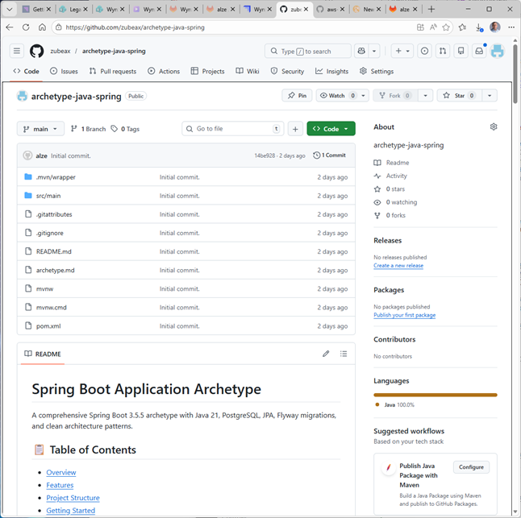

### Configuring Archetypes in Wynxx

Once we created the archetype repositories we can create the Wynxx configuration that provides Wynxx with structured information about them :

- an (arbitrary) archetype name
- base language, i.e. the <b>target</b> language
- repository url and branch
- archetype type (backend/frontend)
- the version control system (VCS) the original source is coming from

<b>CAVEAT</b>: If the archetype URL or repository branch is misconfigured, the [Code Generation](#code-generation) step will fail. Since there is no qualified error message, this misconfiguration is hard to catch.

<b>TODO</b>: Investigate if `Tags` are documentation-only or if they have some ulterior purpose.

Here is a screenshot of the data entry screen for an archetype :

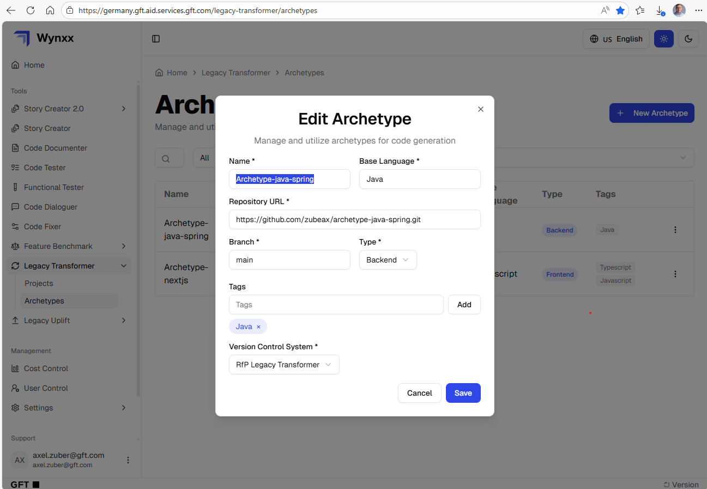

---

## Creating Wynxx Projects

A Wynxx Project is a collection of 4 elements :

- an (arbitrary) project name
- a repository URL for the application to be migrated
- a type (backend/frontend)
- a reference to a predefined Version Control System (defined in [Configuring Version Control System](#configuring-version-control-system))

<b>CAVEAT 1</b>: This step has to be completed once per application repository, so it is not truly one-off.

<b>CAVEAT 2</b>: Similar to archetype repositories, an application repository must be accessible in the internet.

<b>TODO</b>: Investigate how repositories with both frontend and backend components are processed. Do we need 2 Wynxx Projects ?

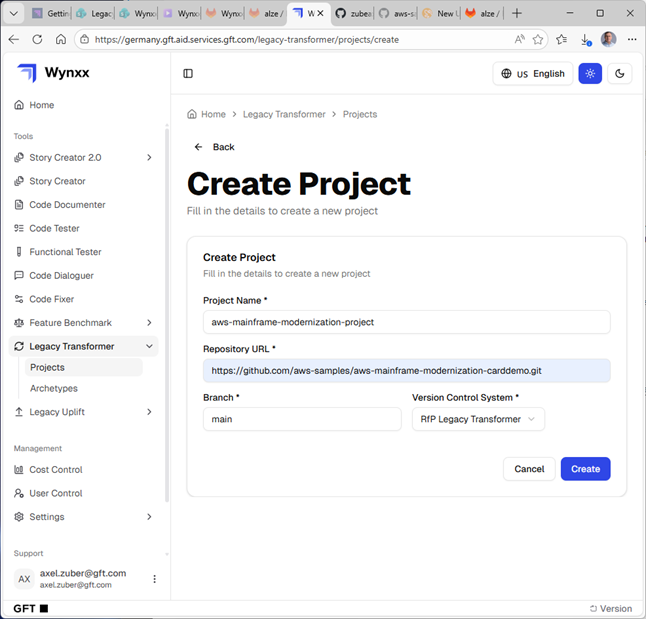

---

## Code Analysis

In this step the Legacy Transformer performs an initial scan of the application source code. Select the project created in the [Creating Wynxx Project](#creating-wynxx-project) step and click the `View` button to open the primary screen.

Then select or enter :

- an LLM (this comes preconfigured, in this instance there is only one)
- one or more analysis types (unless you know what you are doing select all 3 by default)
- a list of file extensions to be included and one with file extensions to be excluded

<b>CAVEAT</b>: any file with an extension not in the `include` list will be ignored even though it is not explicitly excluded !

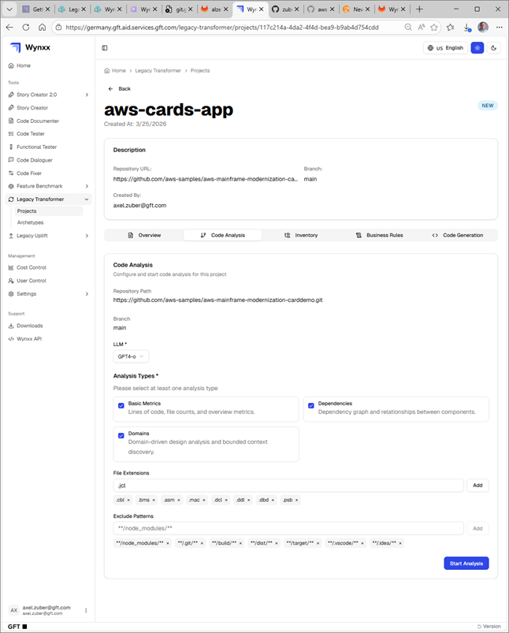

Once the data on this screen is complete, click the `Start Analysis` button in the south-east corner.

While the analysis is ongoing, the screen will display a spinner to the left of `Status` and the number of `attempts` in the bottom right is incremented.

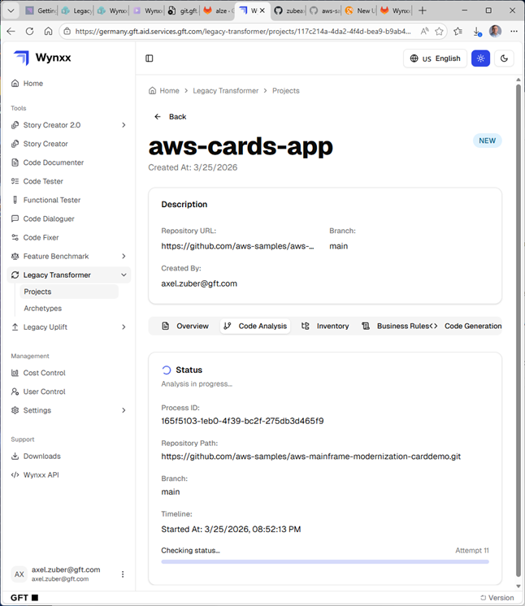

Once this step is complete, the screen refreshes and displays summary application information.

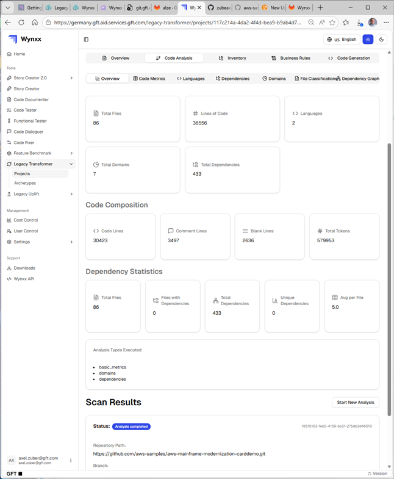

You can further drill down by selecting from the tabs in the toolbar at the top. The menu items are 

- Code Metrics
- Languages
- Dependencies
- Domains
- File Classifications
- Dependency Graph

The screens most relevant for further processing are the `Domains` and `File Classifications` items. 

`Domains` partition the application artefacts into separate buckets which will be referred to in subsequent steps. 

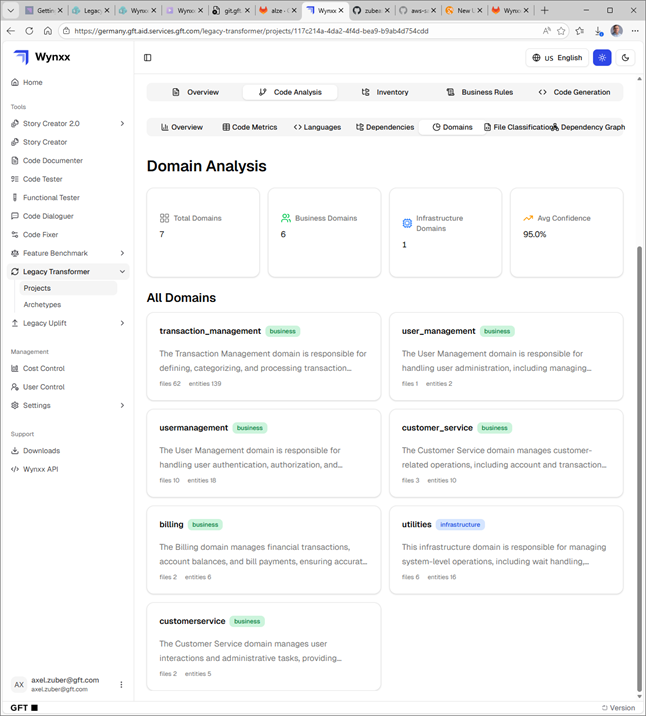

`File Classification` establishes artefact membership in a domain. It is assigned by the Legacy Transformer. The magic happens behind the scenes, one can only guess what the ruleset is.

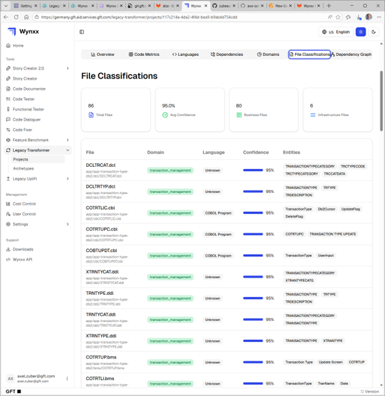

---

## Inventory Generation

### Starting Inventory Generation

This process step does not require configuration. Just click the `Generate Inventory` button at the bottom left.

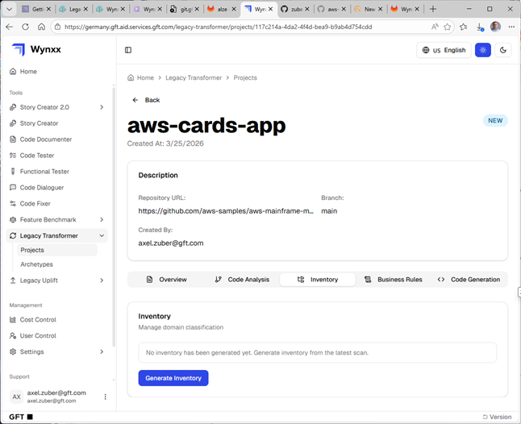

The step completes nearly instantaneously and presents this summary screen.

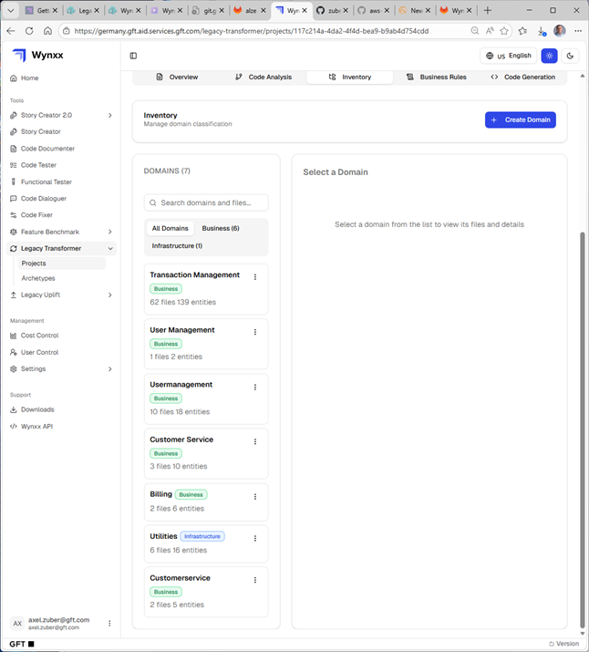

### Reviewing Inventory Domains

The next steps can become quite timeconsuming. Every domain that you consider in-scope has to be reviewed. 

<b>CAVEAT 1</b>: Reviewing requires selecting every domain artefact <b>manually</b>. There is no `select all` feature !

Once all required artefacts are selected, click the green `Mark as reviewed` button. This concludes the review for this domain. 
Repeat this sub-step for all in-scope domains.

<b>CAVEAT 2</b>: The [Code Generation](#code-generation) step apparently ignores `infrastructure` domains. When i was running a use case with a Cobol 'Hello world' program, i had to use the `+ Create Domain` button to create a new `business` domain and then move the artefact with the `Move to Domain` button to this new domain. Only then was i able to select this program for code generation.

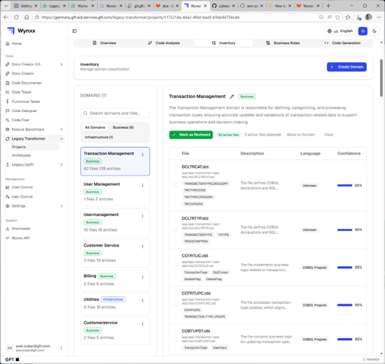

After clicking the `Mark as Reviewed` button, the status of the domain changes to `Reviewed and Locked`.

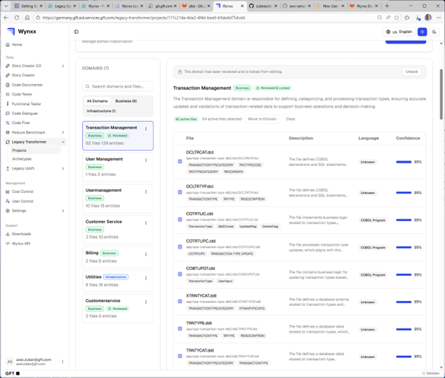

---

## Business Rule Generation

### Starting Business Rule Generation

This step again requires manually iterating over business domains. Select a domain, select an LLM and then hit `Generate All`.

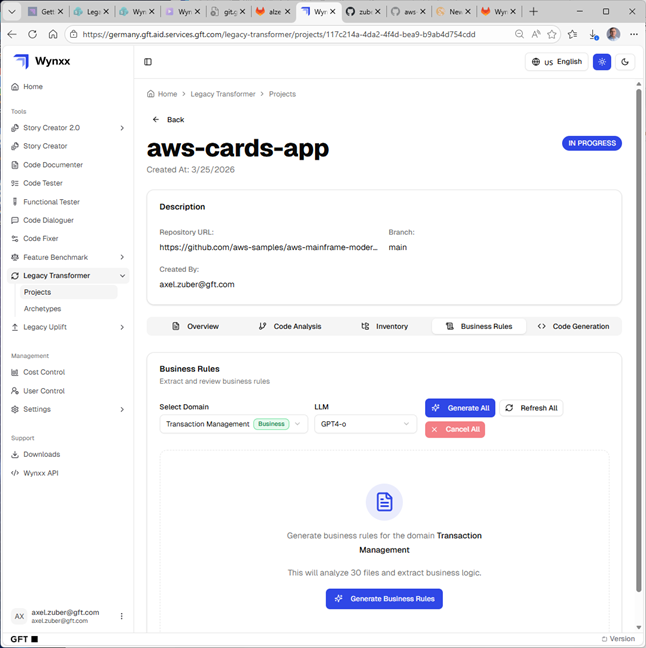

This is the initial screen displayed after starting business rule generation.

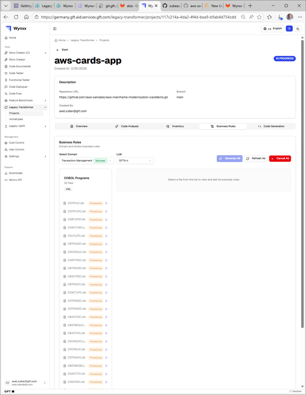

### Reviewing Business Rules

While the business rule generation step processes in the background, the screen is not updated. Hit `PF5` to refresh manually. This will show a changed display as more and more artefacts are processed. 

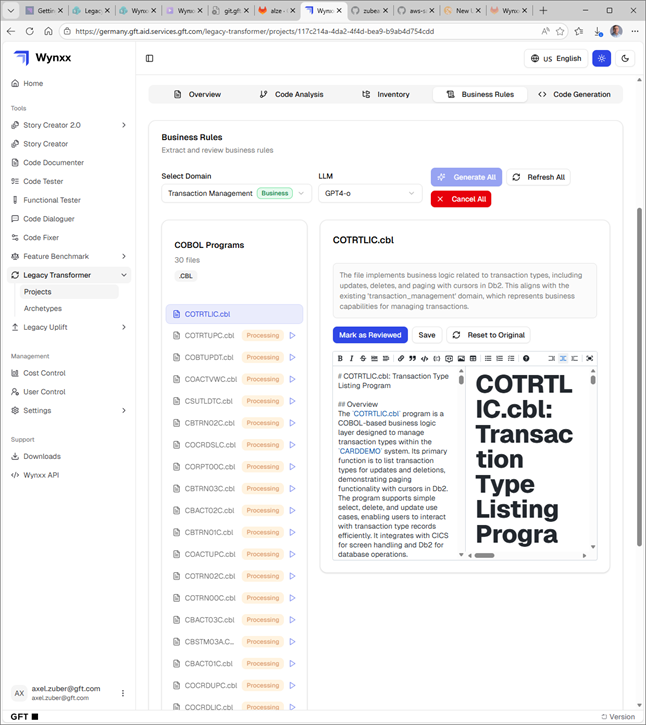

In order to scope the business rule into code generation, we have to earmark <b>every</b> rule by selecting it from the list on the left and then clicking the `Mark as Reviewed` button. The business rule status should change to `Reviewed and Locked`.

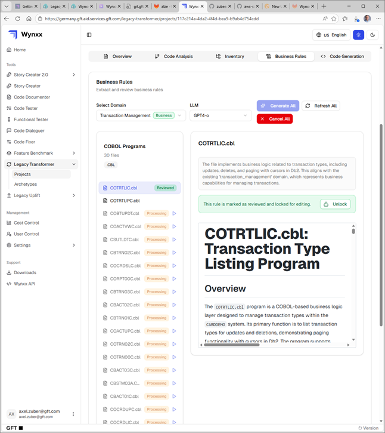

---

## Code Generation

After successfully completing the [Business Rule Generation](#business-rule-generation) step,  we can now finally begin to actually migrate artefacts. We switch to the `<> Code Generation` tab from the toolbar and then select

- a domain from the list on the left
- an archetype that implements our intentions (e.g. convert the application to Java)
- an LLM
 

### Backend Code Generation

Then we click the `Generate Backend Code` button.

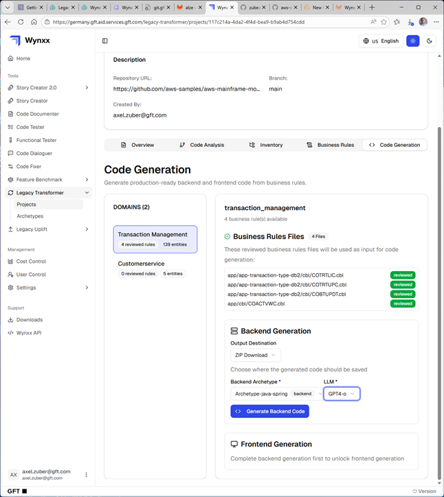

The screen refreshes and displays a new box at the bottom. The status is `IN_PROGRESS` and has an active spinner to its left.

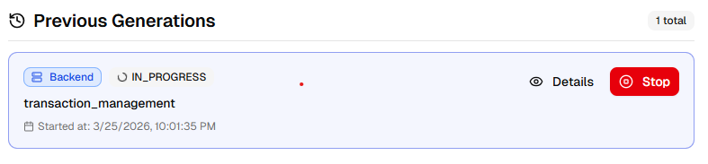

Once the code generation process completes successfully, the status updates to `FINISHED`. You may have to hit the `PF5` key to force the screen to refresh.
I initially ran into generation erors due to an archetype misconfiguration. Such errors are flagged with an `ÈRROR` instead of a `FINISHED` status. Unfortunately there is (currently) no qualified error message that would expose the Wynxx API error message to the UI.

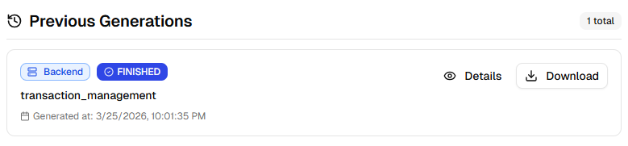

### Frontend Code Generation

If the domain contains frontend artefacts (i.e. BMS maps) we wait until the backend generation completes and then fill in the required details for the `Frontend Generation` group box.

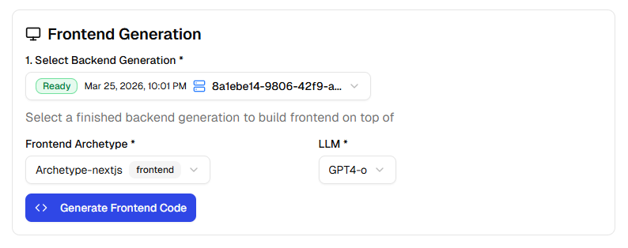

Then we click the `Generate Frontend Code` button.

<b>CAVEAT</b>: This order of steps (Backend 1st, Frontend 2nd) is hardwired into the Legacy Transformer.

### Downloading Generated Code

Hit the `v Download` button to download the generated .zip archive with the migrated source code. Open the downloaded file with an archive manager of your choice.

Here is a screenshot of the contents of the archive :

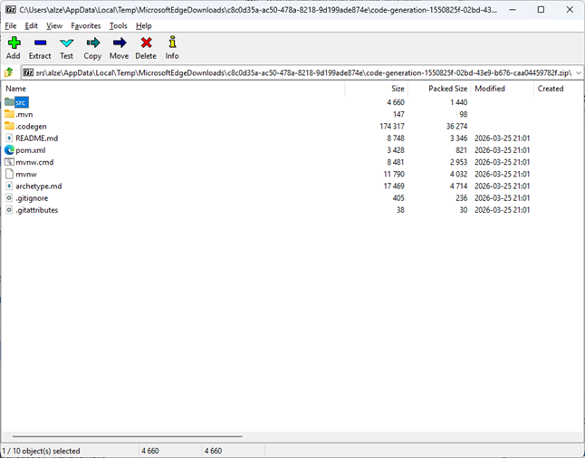

---

# Summary

This paragraph is based on my observations while running a number of use cases with a set of z/OS application flavors by the Legacy Transformer. I had no prior exposure to the tool and learned as i went. When i ran into problems (which happened frequently) i reached out to people throughout the organization. This helped me grow my network but occasionally i would have preferred a more structured process, especially with a product that is marketed to clients.

<b>Disclaimer</b> The oberservations and conclusions below are my own. If somebody takes issue, i am happy to discuss.

- [Workflow](#workflow)
    - [Error Handling](#error-handling)
- [Documentation](#documentation)
- [Performance](#performance)
- [Quality of Generated Code](#quality-of-generated-code)
- [Proposed Changes](#proposed-changes)

## Workflow

In my perception the workflow implemented with the transformation pipeline is not tailored to the needs of the majority of users. It exposes internal application (i.e. `Legacy Transformer`) complexity but the results of the individual transformation steps do not support any informed decision making process. If there were an orchestration layer around this pipeline that simply followed the default path, the entire transformation process could be fully automated.
As it is, the enforced manual review process for the information extracted from application artefacts is a time consuming process that adds little to overall process quality.

Partitioning the application artefacts into domains is an intransparent process that was probably designed to support reverse engineering purposes. For more complex application landscapes creating a 1:N relationship between artefact and domain will not completely reflect application architecture.

`Infrastructure` domains are probably meant to exclude compile, installation and maintenance jobs from transformation. In at least one instance however an application program was assigned to infrastructure and thus excluded from code generation. This required additional manual effort for overriding the decision by creating a dedicated `Business` domain and assigning the asset to this domain.

### Error Handling

Error handling is (apparently) in its early stages. When i ran into a problem with the archetype configuration, i was advised to open the Chrome Developer Console and check the console log for error messages returned by the Wynxx API. While that worked for me and provided the indications required to resolve the problem, it is not a streamlined process. I also think that data entries (e.g. repository URLs) should be validated prior to persisting them in the configuration instead of throwing errors downstream.

## Documentation

Documentation is a patchy topic for Wynxx. Resources are scattered over a number of repositories and media, forcing users to work with educated guesses and figure out transformation recipes on their own by switching into trial-and-error mode.
This is especially challenging for application archetypes. I did not find any in-depth information on how to create an archetype. If it had not been for Pedro who managed to supply me with 2 archetypes provided by staff from Brazil, i would have been stuck for the time being.

## Performance

Performance is is adequate. The API response times for a medium complexity application (the 'Mainframe Modernization Card Demo', published on GitHub by AWS) with 57000 lines of code over several artefact types totaled about 15 minutes. Compared to days (maybe weeks) for a manual process this is perfectly acceptable.

## Quality of Generated Code

Due to the problem mentioned in the overview this paragraph is pending. 

## Proposed Changes

This is a list of action items that i would like to add to the Legacy Transformer feature list for the upcoming releases.

### Error Handling

Advise the user of problems as early as possible during the transformation process. Expose all API errors on the Web UI. Add a log facility for a single process instance providing a consolidated view of errors incurred.

### Documentation

Create a professional documentation repository covering all aspects of Wynxx Legacy Transformer architecture, configuration and operation. IBM Red Books come to mind.

### Application Archetypes

Create a repository of application archetypes that cover the most frequently used tranformation scenarios. Provide documentation for creating archetypes for special scenarios and how to integrate such archetypes with the Code Generation step.

### Adding JCL/REXX/CLIST 

In a presentation on WXSORT the presenter stated that they had migrated JCL to Python. At the moment i would tentatively state that JCL is not in scope.
Neither are REXX or CLIST scripts.
Since JCL is an essential orchestration layer for mainframe batch programs, automated transformation is mandatory. I will follow up on this once the code generation issue is resolved.
REXX scripts (and to a lesser extent CLISTs) are also used for process orchestration, albeit with more degrees of freedom than JCL.
In my experience adding them to automated transformation in the Legacy Transformer is mandatory as well.

---

# Documentation Resources

This is a compilation of references i collected while conducting this exercise.

| Link | Description |
| ---------- | ------------ |
| [Wynxx Zudoku](https://docs.wynxx.app/introduction)  | A Zudoku repository with brief documentation on Wynxx features. |
| [Wynxx Sharepoint](https://gft365.sharepoint.com/sites/Wynxx)  | The official Wynxx sharepoint site. |
| [Sharepoint Documents](https://gft365.sharepoint.com/sites/Wynxx/Folder/Forms/AllItems.aspx)  | The available sharepoint documents. |
| [Legacy Transformer](https://gft365.sharepoint.com/sites/Wynxx/Folder/Forms/AllItems.aspx?viewid=623e8b80%2Db870%2D470e%2Db381%2D3c70ee194dcb&id=%2Fsites%2FWynxx%2FFolder%2FDocumentation%2FManuals%2FTechnical%20Documentation%2FDocumentation%20Legacy%20Transformer%2Epdf&parent=%2Fsites%2FWynxx%2FFolder%2FDocumentation%2FManuals%2FTechnical%20Documentation&isSPOFile=1&xsdata=MDV8MDJ8fDQ5MjVjNjVhZjNjNDQwZGM2YTg5MDhkZTg4Zjc1MTFmfDU1YTJiYzY3YWVjMTRhZDI5YTljNWIyNDU3YjkxZGNkfDB8MHw2MzkwOTg3OTI5MzI1MDIxNTN8VW5rbm93bnxWR1ZoYlhOVFpXTjFjbWwwZVZObGNuWnBZMlY4ZXlKRFFTSTZJbFJsWVcxelgwRlVVRk5sY25acFkyVmZVMUJQVEU5R0lpd2lWaUk2SWpBdU1DNHdNREF3SWl3aVVDSTZJbGRwYmpNeUlpd2lRVTRpT2lKUGRHaGxjaUlzSWxkVUlqb3hNWDA9fDF8TDJOb1lYUnpMekU1T2pSak56TTBaR1ZoTFRZeVl6SXROR1kzTWkwNE9UWTRMVGd5TURBNFpUY3daR0l3TWw4NU1qbG1NRFUzWlMwd1lqTTVMVFF6T0RVdE9EVTBZaTB4TURkbU1XWTNZVEkyTWpkQWRXNXhMbWRpYkM1emNHRmpaWE12YldWemMyRm5aWE12TVRjM05ESTRNalE1TWpNeE53PT18ZDliNzFjNmUxY2E0NDE1MWQ5ZjgwOGRlODhmNzUxMWV8YjQ1NTNmNzBjN2JmNDk4MTlkZTM3OWZjYmY2MTc1MDM%3D&sdata=UVljOGxIMFdhYTBvUzNnazVTWFpxa3JhR0NBSDJ3bDVmUURBVXFqY0drUT0%3D&ovuser=55a2bc67%2Daec1%2D4ad2%2D9a9c%2D5b2457b91dcd%2Calze%40gft%2Ecom&OR=Teams%2DHL&CT=1774943505298&clickparams=eyJBcHBOYW1lIjoiVGVhbXMtRGVza3RvcCIsIkFwcFZlcnNpb24iOiI0OS8yNjAyMjcwNDIxNSIsIkhhc0ZlZGVyYXRlZFVzZXIiOmZhbHNlfQ%3D%3D)  | .pdf File on Legacy Transformer |
| [Legacy Transformer Web Guide](https://gft365.sharepoint.com/:w:/r/sites/Wynxx/_layouts/15/Doc.aspx?sourcedoc=%7BE6D216C7-16A0-4C25-BC76-03E07AF9F648%7D&file=Legacy%20Transformer%20Web%20Guide.docx&action=default&mobileredirect=true&DefaultItemOpen=1) | Web Guide for Legacy Transformer |
